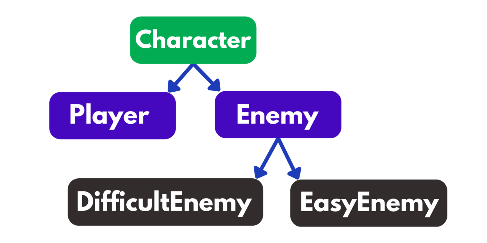

# Video Game Inheritaance in Python
This repository contains video game characters represented by inheritance. Initially the code contains errors made by the development team (check first commit).
This project is designed to practice object-oriented programming (OOP) concepts.

## Goals
* Fix the errors in the code developed by your team.
* Implement the correct hierarchy.

## Requirements
* **`Enemy`** must be a subclass of **`Character`**.
* **`Player`** must be a subclass of **`Character`**.
* **`Enemy`** must be a superclass of **`DifficultEnemy`** and **`EasyEnemy`**.

